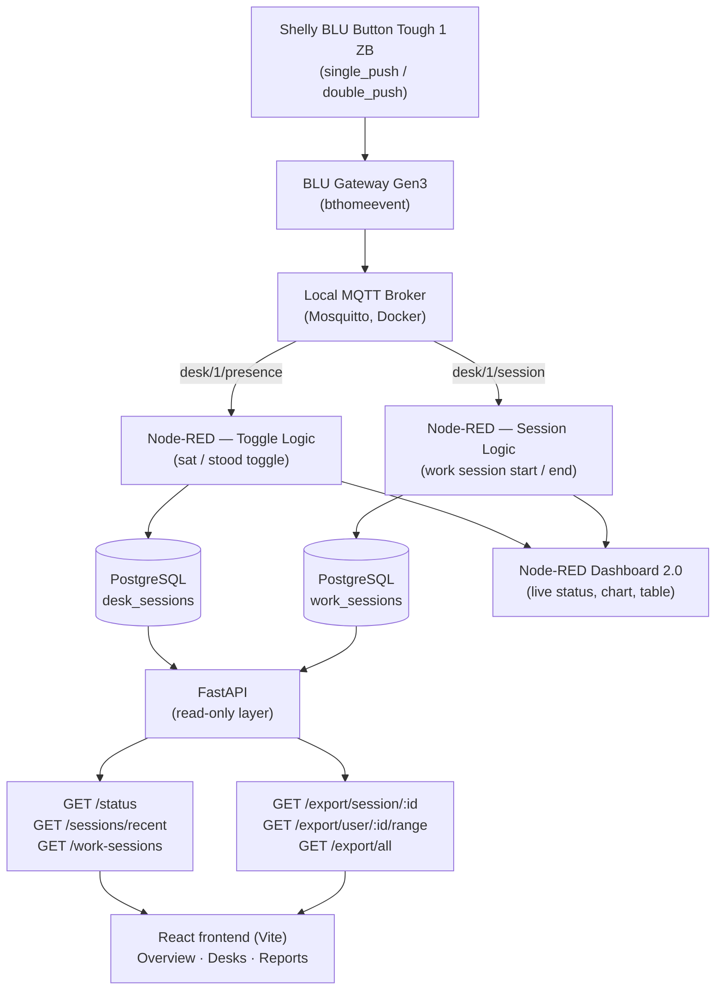

# KadeSI — Desk Presence System

An IoT desk presence tracking system built on a Shelly BLU button: a physical
press records when someone sits down, stands up, and when their working day
starts and ends. Events travel from the button through local MQTT into
Node-RED, which is the only component that writes to PostgreSQL; a read-only
FastAPI layer serves that data to a React dashboard.

This is a learning and pilot project for full-stack IoT development. Phase 1
covers a single desk and a single user, on a schema designed for more.

## Dashboard

<!-- TODO: add screenshot -->


## Functional Requirements

| | Requirement | Status |
|---|---|---|
| **FR1** | A single button press toggles the current state (sat ↔ stood) | ✅ Done |
| **FR2** | Every state change is recorded with a timestamp in PostgreSQL | ✅ Done |
| **FR3** | A double press starts and ends a work session | ✅ Done |
| **FR4** | The dashboard shows the current status in real time | ✅ Done |
| **FR5** | Total sat/stood duration is computed and stored per completed session | ✅ Done |
| **FR6** | CSV export — per session, per user over a period, all users over a period | ✅ Done |
| **FR7** | The schema supports multiple users/desks architecturally | ⚠️ Partial |

**On FR3** — the hardware does not report `long_push` reliably, so a double
press is what delimits a work session.

**On FR7** — both tables carry a `user_id` column (defaulting to 1), and the
three export endpoints are already parameterised by user. The runtime is not:
Node-RED keeps a single global flow-context state rather than one keyed per
desk, and `/status`, `/sessions/recent` and `/work-sessions` return the single
desk without taking a user. Supporting a second desk means reworking that
state, not migrating the schema.

## Non-Functional Requirements

- **NFR1** — Local MQTT rather than cloud API polling, for low latency
- **NFR2** — PostgreSQL for durable storage, not in-memory state
- **NFR3** — Live dashboard latency of about 3 seconds (the frontend polling interval; work session history refreshes every 5 seconds)
- **NFR4** — Docker Compose for infrastructure (Mosquitto); PostgreSQL runs as a native install

## Architecture

Source: [`diagrams/architecture.mermaid`](diagrams/architecture.mermaid)



## Tech Stack

| Layer | Technology |
|---|---|
| Input | Shelly BLU Button Tough 1 ZB + BLU Gateway Gen3 |
| Transport | MQTT (Mosquitto, in Docker) |
| Processing | Node-RED, with Dashboard 2.0 for the built-in live view |
| Storage | PostgreSQL |
| API | FastAPI (Python), read-only |
| Frontend | React (Vite), Recharts |

## Repository Layout

```
api/          FastAPI application (main.py, requirements.txt)
diagrams/     Mermaid architecture diagram
docker/       Docker Compose for Mosquitto
flows/        Node-RED flow export
frontend/     React application (Vite)
logo/         Brand assets
scripts/      Windows helper scripts
schema.sql    PostgreSQL table definitions
```

## Getting Started

### 1. MQTT broker

```bash
cd docker
docker compose up -d
```

Mosquitto listens on port 1883 and is set to `restart: unless-stopped`, so it
comes back after a reboot.

### 2. PostgreSQL

PostgreSQL is expected as a native install, not in Docker. Create the database
and apply the schema:

```bash
createdb -U postgres iot_demo
psql -U postgres -d iot_demo -f schema.sql
```

`schema.sql` also sets the database time zone to `Europe/Sofia`. Both timestamp
columns are `timestamp without time zone` holding local time, so the server's
time zone has to agree with them — otherwise `NOW()` returns UTC and every
interval filter is off by the local offset.

### 3. Node-RED

Import [`flows/flows.json`](flows/flows.json) through the Node-RED editor
(menu → Import). Two things need attention after importing:

- Credentials are not part of the export. Open the PostgreSQL config node and
  re-enter the connection details.
- Set SSL to false in that node's Connection tab, or the connection fails with
  "server does not support SSL connections".

The export contains the desk tracking tab only, not an entire Node-RED
instance.

### 4. FastAPI

```bash
cd api
pip install -r requirements.txt
uvicorn main:app --reload
```

Serves on port 8000; interactive docs at http://127.0.0.1:8000/docs. Database
credentials are currently hardcoded in `api/main.py` — edit `DB_CONFIG` if
yours differ.

### 5. React frontend

```bash
cd frontend
npm install
npm run dev
```

Serves on http://localhost:5173, which is also the only origin allowed by the
API's CORS configuration.

### Shortcut

[`scripts/start-session.bat`](scripts/start-session.bat) offers a menu to start
and stop Node-RED and FastAPI together, and to check whether Mosquitto, port
1880 and port 8000 are up. It assumes Docker and PostgreSQL are already
running, and it contains an absolute path to the repository, so adjust that
path before using it on another machine.

## Known Limitations

- **One real desk.** Only `user_id = 1` exists in practice. Desks 2–6 appear in
  the UI as disabled placeholders. The multi-user path is described under FR7
  above and has not been tested.
- **Flow context is in-memory.** Node-RED holds the active session in flow
  context, so restarting it mid-session leaves a `work_sessions` row with
  `session_end IS NULL` open indefinitely, which `/status` then reports as an
  active session.
- **"Last Session" can show an open session.** The frontend takes the newest
  work session without filtering out unfinished ones, so while a session is
  running the chart reads `NULL` totals and renders empty.
- **No authentication.** The API is unauthenticated and CORS is pinned to
  `http://localhost:5173`. Database credentials live in source. Fine for a
  local pilot, not for anything exposed.
- **Duplicated Node-RED subscriptions are easy to create.** If the flow ends up
  imported onto two tabs, both subscribe to the same MQTT topics and every
  button press writes two rows. Worth checking the tab list if duplicate
  sessions appear.

## License

No license chosen yet — treat this as a private pilot project.
